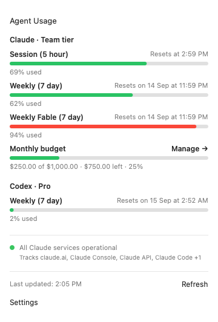

# AgentUsageBar

A macOS menu-bar app for Claude and Codex usage.

The menu bar carries the session and weekly percentages each provider reports, marked
`✳` for Claude and `>_` for Codex. The Codex account below reports only a weekly window:


Clicking it, or pressing Command-U, opens the panel:



## Install

Requires macOS 14 or newer, Apple silicon, and the Xcode command-line tools.

```bash
./setup.sh
```

The script creates a local signing identity if one is missing, builds, replaces any copy
in `/Applications`, and launches the app. Re-running it updates the install: settings live
in the `com.andrewcho.agentusagebar` defaults domain rather than in the bundle, so
replacing the bundle keeps them. Each run also sweeps the preference domains and caches
that earlier builds left behind, and `./setup.sh --clean` runs that sweep alone.

## Features

- Claude session, weekly, scoped, and monthly-budget usage
- Codex rate-limit windows, model meters, credit balances, and reported budgets
- User-supplied monthly limits when a provider reports spend without a limit
- Per-service Claude status tracking
- Only the providers installed on the machine, with the rest silent
- A configurable folder per provider, defaulting to what each CLI installs to
- System, Dark, and Light appearance modes
- Global Command-U panel shortcut
- Start at login by default, with a saved opt-out
- Right-click Refresh and Quit menu

## Credentials

The app stores no credentials. It reads the ones the provider CLIs already own:

| Provider | Source | Usage endpoint |
|---|---|---|
| Claude | Keychain item `Claude Code-credentials` | `api.anthropic.com/api/oauth/usage` |
| Codex | `~/.codex/auth.json` | `chatgpt.com/backend-api/wham/usage` |

A provider whose CLI this machine has never had gets no mention anywhere: no menu-bar
segment, no panel row, no sign-in hint, and for Claude no service-status section. The
fetcher decides that from the folder each CLI writes on its first run, rather than from
the binary, because a login launch inherits no shell `PATH`.

Settings names that folder per provider, for a machine that keeps its agent state
somewhere else. Each provider takes the folder from Settings, then `CLAUDE_CONFIG_DIR` or
`CODEX_HOME` when a shell launched the app, then `~/.claude` or `~/.codex`. The setting
leads because a login launch sees neither variable. Every fetch reports the folder it read
and which of the three named it, so the Settings row shows the folder in use and offers
Clear only for the one it set. A chosen folder that is missing reports itself as a
provider error, where a missing default folder means the CLI was never installed.

The fetcher reads the Claude item by running `/usr/bin/security find-generic-password`.
Claude Code rewrites that item's ACL on every token refresh to trust only that one binary,
so reading through it raises no consent prompt, and the app links no `Security.framework`
code of its own.

## Design

The resident process is a 122 KB Objective-C executable holding fixed-size C records, one
status item, and a hand-drawn panel. It spends about 11 seconds on the CPU per day,
measured as 4 minutes of CPU time across 21 days of uptime. Swift, URLSession, JSON
decoding, and Keychain access run in helper processes that exit after each fetch.

Memory, measured on macOS 26.5.2: the host settles at 12.7 MB before the panel is ever
opened, and at 19.3 MB once it has been. Closing the panel returns nothing measurable,
even though `closePanel` asks the allocator to release what it can.

The app renders its cached snapshot at launch without fetching, and fetches at once when
it loads no usable cache. It refreshes usage and Claude service status every 5 minutes on
a background poll, when the panel opens on data older than 60 seconds, and when the user
selects Refresh. A poll that cannot reach a provider leaves the last numbers in the menu
bar rather than replacing them with an error.

## Build

```bash
cd app
./make_signing_cert.sh  # once, for a stable local Keychain identity
./build.sh
```

The build runs the protocol, cache, and response-decoding tests, compiles size-optimized
arm64 binaries with link-time optimization, signs every helper and the app, and verifies
the nested signature. It writes a 940 KB `app/build/AgentUsageBar.app`, signing with the
`AgentUsageBar Dev` identity when that exists and ad hoc otherwise. Set
`CODESIGN_IDENTITY` to override.
